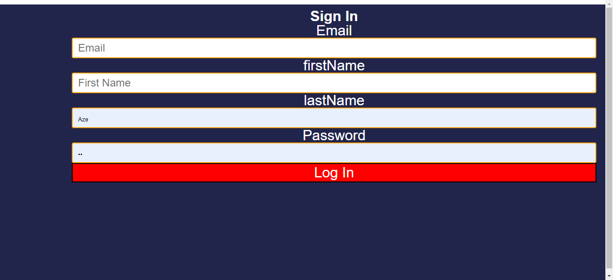

##My-Final-Project-

##Description:

My-Final-Project- Description: My final project is a full stack website that have all kind of movies (hundreds of movies), basically a library of movies (like IMDB or Netflix)) . It have the actoractors for all the movies, as well as their biographies(DOB,biography) as well as the top movies ,most popular ,trending and nowplaying movies

Users can log in and add their feedbacks mentionning what they liked and if they have any suggestions. All the users reviews are added into the database . The user can also add a movie into the wishlist

#Features:

Features:-Sign Up and Login

-Search bar

-wish list and localstorage

-Add Feedback

-display all actors

-See all the reviews from MongoDB database

#Tech used for project : -HTML :

-HTML

-CSS

-MongoDB

Reflection: Challenges#Challenges :

-Understanding the API was really a challenge to deal with because i could not understand it but the Positive about the experience I will be able to understand other API's more easily

-CSS

#What can i make better:

-Choosing a better API

-Adding more functionalities

Functionalities: -Homepage page

#Functionalities:

-Homepage page

-Main Page

-WishList page

#Screenshots:

Homepage:

Main

Actors

Reviews

SignUp

SignIn

WishList

Upcoming Movies

Now Playing Movies

#Next steps:

-Allow users to sign in from Google

-Enable more data manipulation in the database

